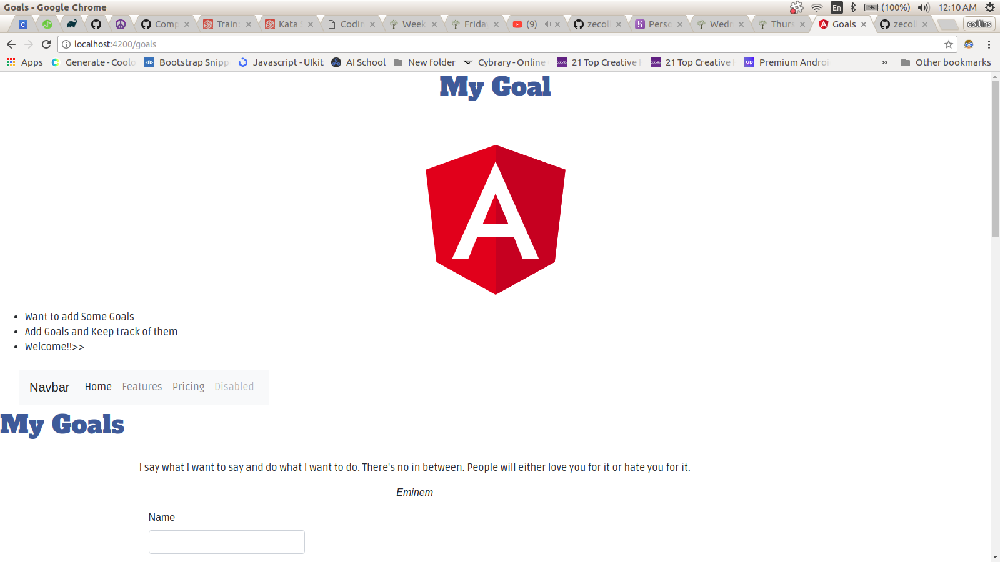
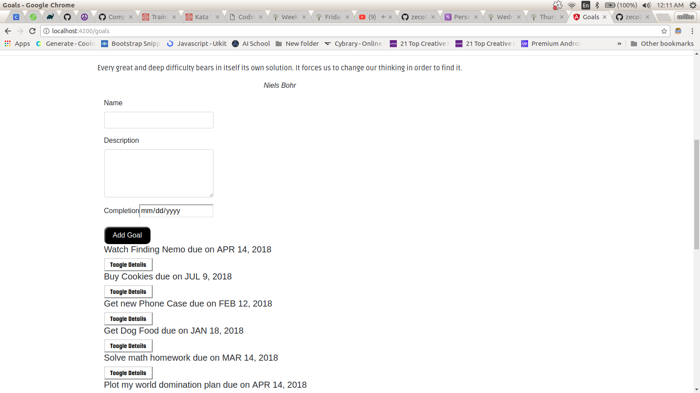
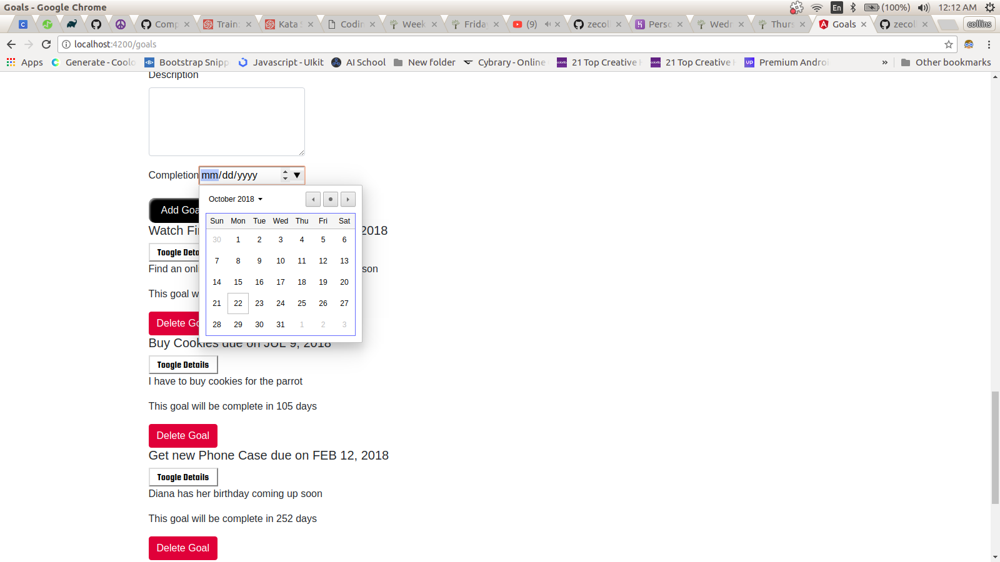
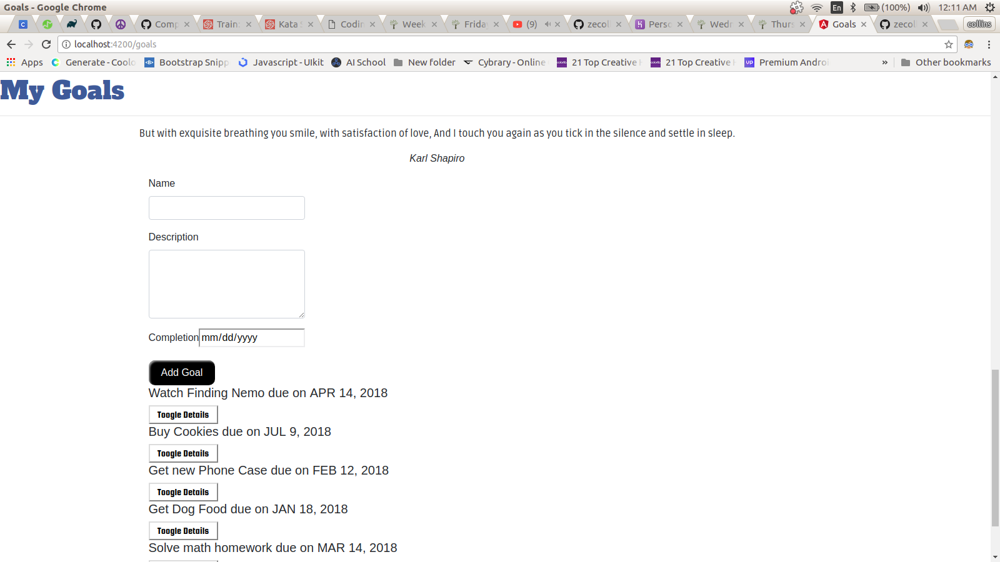

# GOALS

This project was generated with [Angular CLI(https://github.com/angular/angular-cli) version 6.2.1.

# DISPLAY

# DESCRIPTION

This is a simple application using Angular framework that allows you to add goals for you to keep on constantly seeing them.

## User Story

- User can view submited goals.

- Users have a toogle option where they can view goal details.

- Users can see the date the quote was submited.

- Users can see days left to complete goal.

- User can view Quotes generated using a Quotes API

# TECHNOLOGIES USED

1. Angular version 6 (Framework)

2. Type Script

3. [Quotes API](https://talaikis.com/random_quotes_api/)

4. Javascript

## License
---

The app is licensed by MIT. [**HERE**](LICENSE)

MIT (c) 2018
